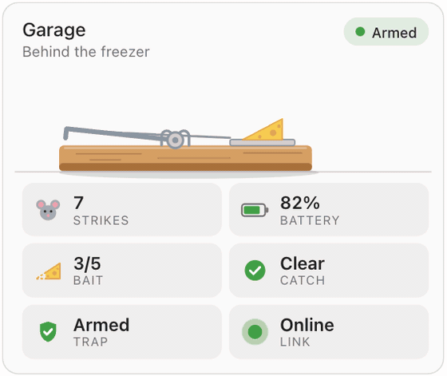
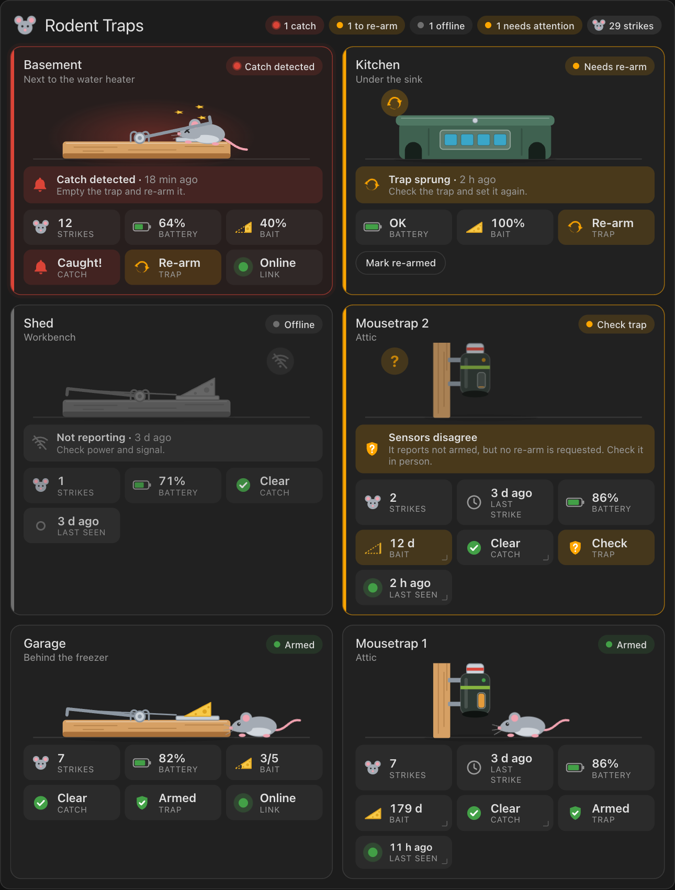

# Rodent Trap Card

A Home Assistant dashboard card that shows the state of your smart rodent traps at a glance: catches, strikes, battery, bait, connectivity, when each trap was last seen and whether it needs re-arming. Each trap gets an animated illustration. There are three kinds: a snap trap, a Goodnature-style CO₂ trap and a bait station. You can run a trap's buttons (clear kill alert, lure replaced, ping) straight from the tile.

[](https://my.home-assistant.io/redirect/hacs_repository/?owner=kedube&repository=ha-rodent-traps&category=plugin)

<p align="center">
  
</p>



## Features

- **Set up a trap by picking its device.** The card matches the device's entity names and device classes to fill in every reading, the device's low-battery and lure-due alerts, and the lure capacity. It also finds the clear-kill-alert, lure-replaced and ping buttons. The name and location come from the device and its area.
- **Readings per trap:** catch (kill) alert, strikes, last strike, battery, bait remaining, armed / needs re-arm, online state and last seen. Each trap uses only the entities it has.
- **Cross-checks the trap.** If a trap reports both *armed* and *re-arm required* and they disagree, the tile says **Check trap** instead of guessing.
- **Knows when a trap has gone quiet.** Set `stale_after` and `offline_after` and a sleepy battery trap is flagged when it hasn't checked in.
- **Buttons on the tile.** Hold a reading to run its action (hold Catch to clear the kill alert, Bait for lure replaced, Last seen to ping), with a confirmation first. You can also add a row of buttons to any trap.
- **Animated illustration** per trap type and state:
  - **Armed:** a mouse sniffs around the trap.
  - **Catch:** the trap goes off live with "SNAP!", "POP!" or "ZAP!", and the tile glows red.
  - **Sprung:** a spinning re-arm badge appears.
  - **Offline:** the trap is greyed out.
  - **Bait:** the drawn bait (cheese, lure window or bait blocks) runs down with the bait level.
- **Readable values.** Durations are rounded to whole units (178.9 days shows as **179 d**, or **26 wk** if you prefer). Long values shrink or wrap instead of being cut off, and each reading's tooltip shows the full value and entity ID.
- **Summary chips** in the header show catches, traps to re-arm, offline traps, traps that need attention and total strikes.
- **Visual editor** with a device picker. Every field shows what the device supplies if you leave it blank.
- **Fits in anywhere.** It follows your theme (light and dark), fits the sections and masonry views, and can be used with a keyboard. It respects your device's reduced-motion setting and pauses animations when the card is off screen.

## Installation

### HACS (recommended)

The card isn't in the HACS default store yet, so add it as a custom repository:

1. In Home Assistant, open **HACS**.
2. Open the **⋮** menu (top right) and choose **Custom repositories**.
3. Enter `https://github.com/kedube/ha-rodent-traps` as the repository and choose **Dashboard** as the type. Select **Add**.
4. Search HACS for **Rodent Trap Card**, open it and select **Download**.
5. Reload your browser (on the mobile app, restart the app or clear the frontend cache).

The **Open in HACS** button at the top of this page does steps 1 to 3 for you.

HACS registers the dashboard resource for you. If you manage dashboards in YAML mode, add the resource yourself:

```yaml
lovelace:
  resources:
    - url: /hacsfiles/ha-rodent-traps/rodent-trap-card.js
      type: module
```

### Manual

1. Download [`dist/rodent-trap-card.js`](dist/rodent-trap-card.js) and copy it to `<config>/www/rodent-trap-card.js`.
2. Go to **Settings → Dashboards → ⋮ → Resources** and add `/local/rodent-trap-card.js` as a **JavaScript module**. If you don't see **Resources**, turn on **Advanced mode** in your user profile.
3. Reload your browser.

## Quick start

Add a card to a dashboard, search for **Rodent Trap Card**, and pick a device for each trap in the visual editor. In YAML, a trap can be as short as its device ID:

```yaml
type: custom:rodent-trap-card
title: Rodent Traps
sort: status
stale_after: 12h
offline_after: 2d
traps:
  - device: 3f1c2a9d8e7b4c6a5f0e1d2c3b4a5f6e   # Goodnature trap 1
  - device: 8a7b6c5d4e3f2a1b0c9d8e7f6a5b4c3d   # Goodnature trap 2
  - name: Garage                               # or list the entities yourself
    kill: binary_sensor.garage_trap_kill
    strikes: sensor.garage_trap_strikes
    battery: sensor.garage_trap_battery
    bait: input_number.garage_trap_bait
```

The visual editor fills in device IDs for you. To find one yourself, open the device in **Settings → Devices & services**; the ID is the last part of the page URL.

## Configuration

### Card options

| Option | Type | Default | Description |
| --- | --- | --- | --- |
| `type` | string | **required** | `custom:rodent-trap-card` |
| `traps` | list | **required** | The traps to show. See [Trap options](#trap-options). |
| `title` | string | none | Card heading. Leave it out for no title. |
| `style` | `snap` \| `goodnature` \| `station` | `snap` | Default illustration for traps that don't set their own. |
| `sort` | `config` \| `status` \| `name` | `config` | `status` puts the most urgent traps first: catches, re-arms, offline, check trap, warnings, then OK. |
| `stale_after` | duration | none | Flag a trap as **Not seen recently** when its `last_seen` is older than this. |
| `offline_after` | duration | none | Treat a trap as **Offline** when its `last_seen` is older than this. |
| `battery_low` | number | `20` | Battery percentage at or below which a trap is flagged, when the device has no low-battery alert of its own. |
| `bait_low` | number | `25` | Bait percentage at or below which a trap is flagged, when the device has no low-bait alert of its own. |
| `columns` | number | automatic | Fixed number of columns. By default, tiles flow into as many columns (about 290 px wide) as fit. |
| `show_summary` | boolean | `true` | Show the summary chips in the header. |
| `show_scene` | boolean | `true` | Show the trap illustrations. Set to `false` for a compact card. |
| `animations` | boolean | `true` | Set to `false` to turn off all motion. The reduced-motion setting on your device is always respected. |

**Durations** can be a number of hours (`12`), a string (`90m`, `12h`, `2d`, `1w`, `1:30:00`), or `{ days: 2, hours: 6 }`.

### Trap options

| Option | Type | Description |
| --- | --- | --- |
| `device` | device ID | Fills in every reading, alert and hold action this page lists that you don't set yourself. See [Device auto-setup](#device-auto-setup). |
| `name` | string | Trap name. Defaults to the device name, then `Trap 1`, `Trap 2` and so on. |
| `location` | string | Shown under the name. Defaults to the area of the device (or of the first entity). Set to `false` to hide it. |
| `style` | `snap` \| `goodnature` \| `station` | Illustration. Defaults to the card's `style`; a Goodnature device is detected automatically. |
| `kill` | entity | Catch or kill alert. |
| `armed` | entity | On means the trap is armed. |
| `rearm` | entity | On means the trap has been sprung and needs re-arming. Use `armed`, `rearm`, or both; with both, a disagreement shows **Check trap**. |
| `strikes` | entity | Number of strikes or catches, added up in the header. An `event` entity here is shown as the last strike instead. |
| `last_strike` | entity | When the trap last struck: an `event` entity or a timestamp sensor. |
| `battery` | entity | Battery level (percent) or a low-battery binary sensor. |
| `bait` | entity | Bait remaining. See [How states are read](#how-states-are-read). |
| `online` | entity | Connectivity, such as a connectivity binary sensor or a Z-Wave node status sensor. If you leave it out, the trap counts as offline when **all** its entities are `unavailable`. |
| `last_seen` | entity | Timestamp of the trap's last check-in. Works with `stale_after` / `offline_after`. |
| `holds` | mapping | Actions that run when you hold a reading. See [Actions](#actions). |
| `actions` | list | Buttons shown on the tile. See [Actions](#actions). |
| `battery_low`, `bait_low` | number | Override the card's thresholds for this trap. |
| `stale_after`, `offline_after` | duration | Override the card's thresholds for this trap. |

Any entity option can be set to `false` to hide something the device would otherwise supply, for example `strikes: false`.

For a single trap, you can put the trap options directly on the card and skip `traps:`.

### Device auto-setup

With `device:`, the card looks through that device's entities and assigns each one to a role by its entity ID, name and device class. Anything you set yourself wins.

| Role | Matches (by name) | Also |
| --- | --- | --- |
| `kill` | `kill_alert`, `kill_detected`, `kills_present`, `catch_detected`, `caught`, `captured` | |
| `strikes` | `strikes`, `strike_count`, `total_kills`, `kill_count`, `catches` | |
| `last_strike` | `event` entities named `strike`, `kill` or `catch`; `last_strike` / `last_kill` timestamp sensors | |
| `armed` | `armed`, `trap_armed`, `is_armed` | |
| `rearm` | `re_arm_required`, `rearm`, `needs_rearm` | |
| `battery` | `battery`, `battery_level` | device class `battery` |
| battery low alert | `battery_low`, `low_battery` | binary sensor with device class `battery` |
| `bait` | `lure_remaining`, `bait_remaining`, `lure_level`, `bait_level` | |
| bait low alert | `lure_due`, `bait_due`, `lure_low`, `replace_lure` | |
| bait capacity | `lure_life`, `bait_life`, `lure_capacity` | |
| `online` | `online`, `connectivity`, `connected`, `node_status` | binary sensor with device class `connectivity` |
| `last_seen` | `last_seen`, `last_report`, `last_heard`, `last_contact` | |
| hold on Catch | `clear_kill_alert`, `clear_catch`, `reset_kill` buttons | |
| hold on Bait | `lure_replaced`, `bait_replaced`, `refill` buttons | |
| hold on Link | `ping` button | |

The low alerts and capacity are attached to the device's own battery and bait entities. The visual editor shows each match under its field ("From device: …"), so you can see what was picked and override it.

### Advanced entity options

Any entity option accepts an object instead of an entity ID. Use it when a device reports something the card doesn't understand by default:

```yaml
traps:
  - name: Pantry
    kill:
      entity: sensor.pantry_trap_status
      active_states: [caught, mouse inside]  # these states count as a catch
    rearm:
      entity: binary_sensor.pantry_trap_problem
      invert: true                           # flip on/off
    battery:
      entity: sensor.pantry_trap_battery
      low_entity: binary_sensor.pantry_trap_battery_low   # the device's own alert beats battery_low
    bait:
      entity: sensor.pantry_trap_lure_remaining
      max: number.pantry_trap_lure_life      # capacity from another entity
      low_entity: binary_sensor.pantry_trap_lure_due
      display_unit: weeks                    # 178.9 d shows as 26 wk
```

| Key | Applies to | Description |
| --- | --- | --- |
| `entity` | all | The entity ID (required in object form). |
| `attribute` | all | Read this attribute instead of the entity's state. |
| `invert` | `kill`, `armed`, `rearm`, `online`, binary `battery`/`bait` | Flip the on/off meaning. |
| `active_states` | `kill`, `armed`, `rearm`, `online` | List of states that mean "yes". Matching ignores case and treats spaces and underscores the same. |
| `min`, `max` | `battery`, `bait` | Range that maps to 0–100%: a number or an entity ID (its state is used, so the range follows the device). Defaults to 0–100, or the helper's own min/max for `input_number` and `number` entities. |
| `low_entity` | `battery`, `bait` | A separate low alert (binary sensor, or states like `low`/`due`). When it reports, it decides whether the reading is low, instead of `battery_low` / `bait_low`. |
| `unit` | `battery`, `bait` | Unit to display, overriding the entity's `unit_of_measurement`. |
| `display_unit` | `battery`, `bait` | For durations: show in `h`, `d`, `weeks` or `months`. |

The visual editor keeps these extra keys when you change the entity, so you can mix the editor with YAML.

### How states are read

| Reading | Counts as "yes" | Counts as "no" |
| --- | --- | --- |
| `kill` | `on`, any number above 0 (for example a *kills present* count), `triggered`, `caught`, `detected`, `occupied`, `captured`, `sprung`, `alert` | `off`, `0`, `clear`, `idle`, `armed`, `empty`, `ready` |
| `armed` | `on`, `armed`, `set`, `ready`, `active` | `off`, `disarmed`, `unarmed`, `sprung`, `triggered`, `tripped`, `fired` |
| `rearm` | `on`, number above 0, `needs_rearm`, `sprung`, `triggered`, `tripped`, `disarmed`, `reset` | `off`, `0`, `armed`, `ready`, `set`, `idle` |
| `online` | `on`, `online`, `connected`, `home`, `alive`, `awake`, `asleep`, or any number (such as signal strength) | `off`, `offline`, `disconnected`, `not_home`, `dead`, `lost`, `unreachable`, or the entity being `unavailable` |

- **Unrecognised states count as unknown, never as "yes".** An `online` entity reporting something the card doesn't know shows **—** rather than **Online**.
- **Z-Wave `node_status` works without extra config.** `asleep` is shown as **Asleep**, `alive` and `awake` as **Online**, and `dead` as **Offline**.
- **`strikes`** is any numeric state.
- **`last_strike`** and **`last_seen`** read a timestamp state: an `event` entity, or a sensor with device class `timestamp`. Other entities use the time they last changed.
- **`battery`** is a percentage. A binary sensor counts as a low battery when `on`. Words like `low`, `critical`, `ok` and `full` also work.
- **`bait`** is a percentage, or a value scaled by its range (a 0–5 helper at 3 shows **3/5**). The words `full`, `high`, `half`, `medium`, `low` and `empty` also work, so an `input_select` is a simple way to track bait by hand. A binary sensor means low bait when `on`.
- **Durations** (units `d`, `h`, `min`, `s`, `wk`, `mo`) are rounded to whole units. Other numbers follow the entity's display precision from Home Assistant.
- **`unavailable` or `unknown`** show as **—**.

### Status and colours

Each trap gets one status. The highest one that applies wins:

| Status | Colour | When |
| --- | --- | --- |
| Catch detected | red, pulsing | `kill` is on |
| Needs re-arm | amber | `rearm` is on, or `armed` is off |
| Offline | grey | `online` is off, `last_seen` is older than `offline_after`, or every entity is unavailable |
| Check trap | amber | `armed` and `rearm` disagree |
| Low battery / low bait / not seen recently / entity not found | amber | a reading is low, `last_seen` is older than `stale_after`, or an entity ID doesn't exist |
| Armed / All good | green | none of the above |

Colours come from your theme's `--error-color`, `--warning-color`, `--success-color` and `--disabled-text-color`.

## Actions

There are two ways to run things from a tile: hold a reading, or add buttons. Both call Home Assistant directly, so you don't need a separate section of buttons for each trap.

### Hold a reading

Readings with a hold action have a small corner mark. Press and hold one (or right-click it, or focus it and press Shift+Enter). The tile asks for confirmation, then runs the action and shows the result.

With `device:`, the card sets these up from the device's buttons: **Catch** clears the kill alert, **Bait** marks the lure replaced, and **Last seen / Link** pings the trap. Add or change them with `holds:`:

```yaml
- device: 3f1c2a9d8e7b4c6a5f0e1d2c3b4a5f6e
  holds:
    kill: button.goodnature_trap_1_clear_kill_alert   # hold on Catch
    bait: script.log_lure_change                       # hold on Bait
    link: false                                        # no hold on Last seen
    strikes:                                           # hold on Strikes
      action: counter.reset
      target:
        entity_id: counter.pantry_trap_strikes
      name: Reset count
      confirm: Reset the strike count to zero?
```

Hold keys are the readings: `kill`, `trap` (armed / re-arm), `strikes`, `last_strike`, `battery`, `bait` and `link` (online / last seen). `catch`, `armed`, `rearm`, `online` and `last_seen` work as aliases. Tapping a reading still opens its more-info dialog.

### Buttons on the tile

`actions:` adds a row of buttons under the readings. Buttons run straight away unless you set `confirm`.

```yaml
- device: 3f1c2a9d8e7b4c6a5f0e1d2c3b4a5f6e
  actions:
    - button.goodnature_trap_1_ping                  # just an entity
    - entity: button.goodnature_trap_1_lure_replaced
      name: New lure
      icon: mdi:cheese
      confirm: true
```

### Action format

Anywhere an action goes (`holds`, `actions`), you can give:

| Form | What it runs |
| --- | --- |
| an entity ID | `button`/`input_button` → press, `script` → run, `scene` → activate, `automation` → trigger, `switch`/`input_boolean`/`light`/`fan` → toggle |
| `entity`, plus optional `name`, `icon`, `confirm` | as above, with a custom label |
| `action` (for example `counter.reset`), optional `target` and `data`, `name`, `icon`, `confirm` | any Home Assistant action |

`confirm` is `true`, `false` or your own question. Holds confirm by default, and buttons don't.

## Examples

### Goodnature traps on Z-Wave

With the device picked, this is usually all you need. Here is the same trap with a couple of overrides:

```yaml
type: custom:rodent-trap-card
title: Attic
stale_after: 12h        # battery traps check in rarely; flag after 12 hours
offline_after: 2d
traps:
  - device: 3f1c2a9d8e7b4c6a5f0e1d2c3b4a5f6e
  - device: 8a7b6c5d4e3f2a1b0c9d8e7f6a5b4c3d
    name: Mousetrap 2 (eaves)
    bait:
      entity: sensor.goodnature_trap_2_lure_remaining
      max: number.goodnature_trap_2_lure_life
      display_unit: weeks
```

### A classic snap trap with a contact sensor

Stick a Zigbee door/window sensor to a snap trap so that it opens when the bar swings. Track strikes with a counter helper and bait with an `input_select` that you update by hand:

```yaml
type: custom:rodent-trap-card
traps:
  - name: Pantry
    rearm: binary_sensor.pantry_trap_contact          # opens when the trap snaps
    battery: sensor.pantry_trap_contact_battery
    strikes: counter.pantry_trap_strikes
    bait: input_select.pantry_trap_bait               # Full / Half / Low / Empty
    holds:
      strikes: { action: counter.reset, target: { entity_id: counter.pantry_trap_strikes }, name: Reset count }
```

```yaml
# automations.yaml: count every snap
- alias: Pantry trap strike
  triggers:
    - trigger: state
      entity_id: binary_sensor.pantry_trap_contact
      to: "on"
  actions:
    - action: counter.increment
      target:
        entity_id: counter.pantry_trap_strikes
```

### Traps that report kill counts

Many connected traps expose a *kills present* count (catches waiting to be emptied) and a *total kills* count. Use the first for `kill` and the second for `strikes`:

```yaml
- name: Crawlspace
  style: station
  kill: sensor.crawlspace_trap_kills_present
  strikes: sensor.crawlspace_trap_total_kills
  battery: sensor.crawlspace_trap_battery_level
  online: sensor.crawlspace_trap_wireless_signal    # any numeric reading means online
```

### Get a phone notification on a catch

The card only displays state and runs actions you ask for. Pair it with an automation to get alerts:

```yaml
- alias: Rodent trap catch
  triggers:
    - trigger: state
      entity_id:
        - binary_sensor.goodnature_trap_1_kill_alert
        - binary_sensor.goodnature_trap_2_kill_alert
      to: "on"
  actions:
    - action: notify.mobile_app_your_phone
      data:
        title: Trap caught something
        message: "{{ trigger.to_state.name }} needs emptying."
```

## Troubleshooting

- **"Custom element doesn't exist: rodent-trap-card".** The resource isn't loaded. Check the resource URL, then reload the browser. On the mobile app, clear the frontend cache under **Settings → Companion app → Debugging**.
- **A device reading is wrong or missing.** Open the trap in the visual editor: each field shows which entity the device supplied. Pick a different entity to override it, or set the option to `false` in YAML to hide it.
- **A reading shows "—".** The entity is `unavailable` or `unknown`, or its state is a word the card doesn't recognise. Add `active_states` (on/off readings) or `min`/`max` (levels) as shown in [Advanced entity options](#advanced-entity-options).
- **"Check trap".** The trap's armed and re-arm sensors contradict each other. Check the trap in person. If the device reports these sensors with the opposite meaning, add `invert: true` to one of them.
- **"Entity not found".** An entity ID is misspelled or the entity was removed. The tile lists the IDs it couldn't find, including those used for `max`, `min` and `low_entity`.
- **A hold action fails.** The tile shows the error from Home Assistant. Entities other than buttons, scripts, scenes, automations and toggles need an explicit `action:`.
- **The visual editor says it can't load.** Switch to the code editor. Everything is also configurable in YAML.

## Development

The card is a single dependency-free file, [`dist/rodent-trap-card.js`](dist/rodent-trap-card.js), with no build step.

- **Try it without Home Assistant:** open [`demo/index.html`](demo/index.html) in a browser. It runs the real card against simulated entities, including two Goodnature-style devices set up with `device:` alone. Buttons trigger strikes, drain lure and batteries, and take traps offline; hold actions call a simulated Home Assistant.
- **Release:** bump `VERSION` at the top of the card file, commit, then publish a GitHub release tagged `vX.Y.Z`. HACS offers the new version to users.
- **CI:** [`.github/workflows/validate.yml`](.github/workflows/validate.yml) runs the HACS validation action and a syntax check.

## License

[GPL-3.0](LICENSE)
