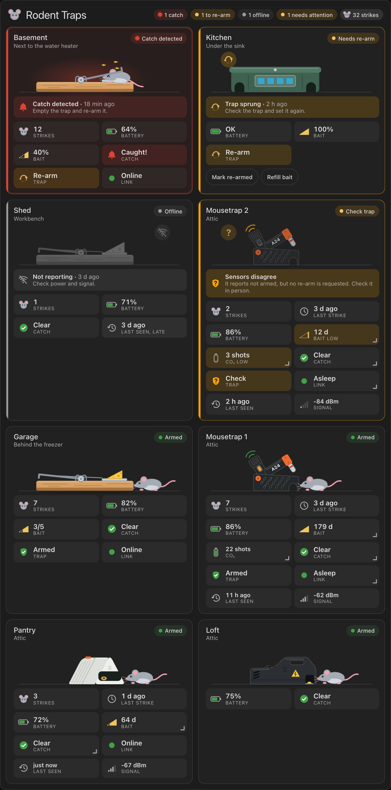

# Rodent Trap Card

A Home Assistant dashboard card that shows the state of your smart rodent traps at a glance: catches, strikes, battery, bait, connectivity, when each trap was last seen and whether it needs re-arming. Each trap gets an animated illustration. There are three kinds: a snap trap, a Goodnature-style CO₂ trap and a bait station. You can run a trap's buttons (clear kill alert, lure replaced, ping) straight from the tile.

[](https://my.home-assistant.io/redirect/hacs_repository/?owner=kedube&repository=ha-rodent-traps&category=plugin)

<p align="center">
  
</p>



## Features

- **Set up a trap by picking its device.** The card matches the device's entity names and device classes to fill in every reading, the device's low-battery and lure-due alerts, and the lure capacity. It also finds the clear-kill-alert, lure-replaced and ping buttons. The name and location come from the device and its area.
- **Readings per trap:** catch (kill) alert, strikes, last strike, battery, bait remaining, armed / needs re-arm, online state and last seen. Each trap uses only the entities it has.
- **Cross-checks the trap.** If a trap reports both *armed* and *re-arm required* and they disagree, the tile says **Check trap** instead of guessing.
- **Knows when a trap has gone quiet.** Set `stale_after` and `offline_after` and a sleepy battery trap is flagged when it hasn't checked in.
- **Buttons on the tile.** Hold a reading to run its action (hold Catch to clear the kill alert, Bait for lure replaced, Last seen to ping), with a confirmation first. You can also add a row of buttons to any trap.
- **Animated illustration** per trap type and state:
  - **Armed:** a mouse sniffs around the trap and darts off twice, then sits still. It plays again when the trap is set again.
  - **Catch:** the trap goes off live with "SNAP!", "POP!" or "ZAP!", and the tile turns red with a pulsing ring. It plays once, when the catch is reported, even when the device reports the catch, the count and the time as separate updates. It doesn't play again when you come back to the dashboard, or when an integration reloads and brings back a catch it already had.
  - **Sprung:** a spinning re-arm badge appears.
  - **Offline:** the trap is greyed out.
  - **Bait:** the drawn bait (cheese, lure window or bait blocks) runs down with the bait level.
- **Readable values.** Durations are rounded to whole units (178.9 days shows as **179 d**, or **26 wk** if you prefer). Long values shrink or wrap instead of being cut off, and each reading's tooltip shows the full value, its hold action and the entity ID.
- **Summary chips** in the header show catches, traps to re-arm, offline traps, traps that need attention and total strikes.
- **Visual editor** with a device picker. Every field shows what the device supplies if you leave it blank.
- **Fits most dashboards.** One or two traps stretch across a wide card, and narrow tiles (half a section, a grid card) switch to a compact layout that keeps each trap's name and values readable. It fits the sections and masonry views, and works with a keyboard and screen readers (see [Keyboard and screen readers](#keyboard-and-screen-readers)). For several traps, use one card with a `traps:` list rather than a stack of single-trap cards: the tiles share the width, and the header adds up their status.
- **Follows your theme.** Status colours come from your theme (light and dark), and the illustrations' colours can be themed too (see [Theme colours](#theme-colours)). [card-mod](https://github.com/thomasloven/lovelace-card-mod) styles override the card's own.
- **Easy on wall panels.** The idle animations stop after about 25 seconds; only a trap that needs attention keeps moving. It respects your device's reduced-motion setting and pauses animations when the card is off screen.

## Installation

### HACS (recommended)

The card isn't in the HACS default store yet, so add it as a custom repository:

1. In Home Assistant, open **HACS**.
2. Open the **⋮** menu (top right) and choose **Custom repositories**.
3. Enter `https://github.com/kedube/ha-rodent-traps` as the repository and choose **Dashboard** as the type. Select **Add**.
4. Search HACS for **Rodent Trap Card**, open it and select **Download**.
5. Reload your browser (on the mobile app, restart the app or clear the frontend cache).

The **Open in HACS** button at the top of this page does steps 1 to 3 for you.

HACS registers the dashboard resource for you. If you manage dashboards in YAML mode, add the resource yourself:

```yaml
lovelace:
  resources:
    - url: /hacsfiles/ha-rodent-traps/rodent-trap-card.js
      type: module
```

### Manual

1. Download [`rodent-trap-card.js`](https://github.com/kedube/ha-rodent-traps/releases/latest/download/rodent-trap-card.js) from the latest release and copy it to `<config>/www/rodent-trap-card.js`.
2. Go to **Settings → Dashboards → ⋮ → Resources** and add `/local/rodent-trap-card.js?v=1.1` as a **JavaScript module**, using the version you downloaded. If you don't see **Resources**, turn on **Advanced mode** in your user profile.
3. Reload your browser.

To update, replace the file and change the `?v=` number on the resource. Browsers cache files under `/local/`, and a new URL makes them fetch the new one.

## Quick start

Add a card to a dashboard, search for **Rodent Trap Card**, and pick a device for each trap in the visual editor. The new card is pre-filled with up to four devices that look like traps (or, failing that, groups of entities whose IDs mention a trap); remove any that aren't traps, since a device called "mouse" can be a computer mouse. In Home Assistant 2026.6 and later, the card is also suggested under **Community** when you pick one of a trap's entities in the card picker. In YAML, a trap can be as short as its device ID:

```yaml
type: custom:rodent-trap-card
title: Rodent Traps
sort: status
stale_after: 12h
offline_after: 2d
traps:
  - device: 3f1c2a9d8e7b4c6a5f0e1d2c3b4a5f6e   # Goodnature trap 1
  - device: 8a7b6c5d4e3f2a1b0c9d8e7f6a5b4c3d   # Goodnature trap 2
  - name: Garage                               # or list the entities yourself
    kill: binary_sensor.garage_trap_kill
    strikes: sensor.garage_trap_strikes
    battery: sensor.garage_trap_battery
    bait: input_number.garage_trap_bait
```

The visual editor fills in device IDs for you. To find one yourself, open the device in **Settings → Devices & services**; the ID is the last part of the page URL.

## Configuration

### Card options

| Option | Type | Default | Description |
| --- | --- | --- | --- |
| `type` | string | **required** | `custom:rodent-trap-card` |
| `traps` | list | **required** unless you use the single-trap form | The traps to show. See [Trap options](#trap-options). |
| `title` | string | none | Card heading. Leave it out for no title. |
| `style` | `snap` \| `goodnature` \| `station` | `snap` | Illustration for traps that don't set their own and whose device isn't detected (see the trap's `style`). `auto` is the same as leaving it out. |
| `sort` | `config` \| `status` \| `name` | `config` | `status` puts the most urgent traps first: catches, re-arms, offline, check trap, warnings, status unknown, then OK. |
| `stale_after` | duration | none | Flag a trap as **Not seen recently** when its `last_seen` is older than this. |
| `offline_after` | duration | none | Treat a trap as **Offline** when its `last_seen` is older than this. |
| `battery_low` | number | `20` | Battery percentage at or below which a trap is flagged, when the device has no low-battery alert of its own. |
| `bait_low` | number | `25` | Bait percentage at or below which a trap is flagged, when the device has no low-bait alert of its own. |
| `columns` | number | automatic | The most tiles to put side by side. Tiles stay at least 250 px wide, so a narrow card (a phone, say) shows fewer columns than this. By default, tiles flow into as many columns (about 290 px wide) as fit, and one or two traps stretch across a wide card. |
| `show_summary` | boolean | `true` | Show the summary chips in the header. |
| `show_scene` | boolean | `true` | Show the trap illustrations. Set to `false` for a compact card. |
| `animations` | boolean | `true` | Set to `false` to turn off all motion, including "SNAP!", the red "+1" and the strike count-up. The count and the banner still show a catch. Your device's reduced-motion setting does the same, whatever this is set to. On a low-power wall panel or an old tablet that is always on, `false` saves battery and heat: a trap with a catch or a warning otherwise keeps its alert animations running until you deal with it. |

**Durations** can be:

- a number of hours: `12`
- numbers with units: `90m`, `12h`, `2d`, `1w`, `1d 12h`, `1h30m` or `2 days and 3 hours`. Units can be short (`s`, `m` or `min`, `h`, `d`, `w`, `mo`) or written out (`minutes`, `days` and so on).
- a time: `36:00:00`, `1:30` or `1 day, 12:00:00`
- a mapping: `{ days: 1, hours: 12 }`

`false`, `0`, `none`, `off` or `never` turns a threshold off. On a trap, that overrides the card's threshold.

The card checks option values when it loads. A duration it can't read, a misspelt `style` or `sort`, an unknown hold key or an action it can't run shows a configuration error that names the option. Without the check, a typo would quietly turn off offline detection or run the wrong thing.

**Layout.** Tiles narrower than about 260 px (half a section, a grid card, `columns` on a phone) switch to a compact layout: the status goes under the trap's name, and each reading's icon sits above its value. Below about 180 px the readings are in one column. In the sections view the card sizes itself to its content. If you give it a fixed number of rows instead, it stays inside them and scrolls, rather than spilling over the cards below.

### Trap options

| Option | Type | Description |
| --- | --- | --- |
| `device` | device ID | Fills in every reading, alert and hold action this page lists that you don't set yourself. See [Device auto-setup](#device-auto-setup). |
| `name` | string | Trap name. Defaults to the device name, then `Trap 1`, `Trap 2` and so on. |
| `location` | string | Shown under the name. Defaults to the area of the device (or of the first entity). A device without an area of its own, such as a trap that Home Assistant lists under its hub, uses its parent device's area. Set to `false` to hide it. |
| `style` | `snap` \| `goodnature` \| `station` \| `auto` | Illustration. Without it, a device whose manufacturer or model mentions Goodnature gets `goodnature`, and one that mentions a station gets `station`; any other trap uses the card's `style`. A trap's own style beats the detection, and the detection beats the card's `style`. |
| `kill` | entity | Catch or kill alert. |
| `armed` | entity | On means the trap is armed. |
| `rearm` | entity | On means the trap has been sprung and needs re-arming. Use `armed`, `rearm`, or both; with both, a disagreement shows **Check trap**. |
| `strikes` | entity | Number of strikes or catches, added up in the header. An `event` entity here is shown as the last strike instead. |
| `last_strike` | entity | When the trap last struck: an `event` entity, a timestamp sensor or an `input_datetime` helper. |
| `battery` | entity | Battery level (percent), a low-battery binary sensor, or a voltage with a `min` and `max` range (see [Advanced entity options](#advanced-entity-options)). |
| `bait` | entity | Bait remaining. See [How states are read](#how-states-are-read). |
| `online` | entity | Connectivity, such as a connectivity binary sensor or a Z-Wave node status sensor. If you leave it out, the trap counts as offline when **all** its device entities are `unavailable`. Helpers (`counter`, `input_*`, `timer`, `schedule`) are ignored for this, because they never go unavailable. |
| `last_seen` | entity | Timestamp of the trap's last check-in. Works with `stale_after` / `offline_after`. |
| `holds` | mapping | Actions that run when you hold a reading. See [Actions](#actions). |
| `actions` | list | Buttons shown on the tile. See [Actions](#actions). |
| `battery_low`, `bait_low` | number | Override the card's thresholds for this trap. |
| `stale_after`, `offline_after` | duration | Override the card's thresholds for this trap. |

Any entity option can be set to `false` to hide something the device would otherwise supply, for example `strikes: false`.

**Single-trap form.** For a single trap, you can put the trap options directly on the card and skip `traps:`. The visual editor moves them under `traps:` the first time you change something there. Card options such as the thresholds stay on the card, and `style` is copied to the trap so it still beats device detection.

### Device auto-setup

With `device:`, the card looks through that device's entities and assigns each one to a role by its entity ID, name and device class. Short names such as `arm_state` and `rearm` must start a word, so `alarm_state` doesn't count as armed. Anything you set yourself wins.

| Role | Matches (by name) | Also |
| --- | --- | --- |
| `kill` | `kill_alert`, `kill_detected`, `kills_present`, `catch_detected`, `caught`, `captured` | |
| `strikes` | ends in `strikes`, `catches` or `kills` (optionally followed by `_count` or `_total`); `total_kills`, `kill_count`, `strike_count`, `catch_count` | not `last_strike`, and not a timestamp sensor |
| `last_strike` | `event` entities named `strike`, `kill` or `catch`; `last_strike` / `last_kill` timestamp sensors | |
| `armed` | `armed`, `trap_armed`, `is_armed`, `arm_state`, `armed_state` | |
| `rearm` | `re_arm_required`, `rearm`, `rearm_needed`, `needs_rearm` | |
| `battery` | `battery`, `battery_level`, `battery_percentage` | device class `battery`; voltage sensors are skipped |
| battery low alert | `battery_low`, `low_battery` | binary sensor with device class `battery` |
| `bait` | `lure_remaining`, `bait_remaining`, `lure_level`, `bait_level` | |
| bait low alert | `lure_due`, `bait_due`, `lure_low`, `replace_lure` | |
| bait capacity | `lure_life`, `bait_life`, `lure_capacity` | |
| `online` | `online`, `connectivity`, `connected`, `node_status` | binary sensor with device class `connectivity` |
| `last_seen` | `last_seen`, `last_report`, `last_heard`, `last_contact` | |
| hold on Catch | buttons ending in `clear_kill_alert`, `clear_catch`, `clear_alert`, `kill_alert_clear`, `reset_kill` or `reset_catch` | not `reset_kill_count` |
| hold on Bait | buttons ending in `lure_replaced`, `bait_replaced`, `bait_refilled`, `replace_lure` or `refill` | |
| hold on Link | `ping` button | |

The low alerts and capacity are attached to the device's own battery and bait entities. The visual editor shows each match under its field ("From device: …"), so you can see what was picked and override it.

### Advanced entity options

Any entity option accepts an object instead of an entity ID. Use it when a device reports something the card doesn't understand by default:

```yaml
traps:
  - name: Pantry
    kill:
      entity: sensor.pantry_trap_status
      active_states: [caught, mouse inside]  # these states count as a catch
    rearm:
      entity: binary_sensor.pantry_trap_problem
      invert: true                           # flip on/off
    battery:
      entity: sensor.pantry_trap_battery
      low_entity: binary_sensor.pantry_trap_battery_low   # the device's own alert beats battery_low
    bait:
      entity: sensor.pantry_trap_lure_remaining
      max: number.pantry_trap_lure_life      # capacity from another entity
      low_entity: binary_sensor.pantry_trap_lure_due
      display_unit: weeks                    # 178.9 d shows as 26 wk
```

| Key | Applies to | Description |
| --- | --- | --- |
| `entity` | all | The entity ID (required in object form). |
| `attribute` | all | Read this attribute instead of the entity's state. |
| `invert` | `kill`, `armed`, `rearm`, `online`, binary `battery`/`bait` | Flip the on/off meaning. |
| `active_states` | `kill`, `armed`, `rearm`, `online` | List of states that mean "yes". Every other state then means "no"; only `unavailable` and `unknown` stay unknown. To list the states that mean "no" instead, list those and add `invert: true`. Matching ignores case and treats spaces and underscores the same. |
| `min`, `max` | `battery`, `bait` | Range that maps to 0–100%: a number or an entity ID (its state is used, so the range follows the device). Defaults to 0–100, or the helper's own min/max for `input_number` and `number` entities; a `min` or `max` you set wins over the helper's. A voltage (`V`, `mV` or device class `voltage`) shows as a plain value until you set its range, for example `min: 2.4` and `max: 3.2` for two AA cells. If `max` isn't above `min` (a capacity entity reporting 0, say), the value is shown as it is and never counts as low. |
| `low_entity` | `battery`, `bait` | A separate low alert (binary sensor, or states like `low`/`due`). When it reports, it decides whether the reading is low, instead of `battery_low` / `bait_low`. |
| `unit` | `battery`, `bait` | Unit to display, overriding the entity's `unit_of_measurement`. |
| `display_unit` | `battery`, `bait` | For durations: show in `h`, `d`, `weeks` or `months`. |

The visual editor keeps these extra keys when you change the entity, so you can mix the editor with YAML.

### How states are read

| Reading | Counts as "yes" | Counts as "no" |
| --- | --- | --- |
| `kill` | `on`, any number above 0 (for example a *kills present* count), `triggered`, `caught`, `detected`, `occupied`, `captured`, `sprung`, `alert` | `off`, `0`, `clear`, `idle`, `armed`, `empty`, `ready` |
| `armed` | `on`, `armed`, `set`, `ready`, `active` | `off`, `disarmed`, `unarmed`, `sprung`, `triggered`, `tripped`, `fired` |
| `rearm` | `on`, number above 0, `needs_rearm`, `sprung`, `triggered`, `tripped`, `disarmed`, `reset` | `off`, `0`, `armed`, `ready`, `set`, `idle` |
| `online` | `on`, `online`, `connected`, `home`, `alive`, `awake`, `asleep`, or any number (such as signal strength) | `off`, `offline`, `disconnected`, `not_home`, `dead`, `lost`, `unreachable`, or the entity being `unavailable` |

- **Unrecognised states count as unknown, never as "yes".** An `online` entity reporting something the card doesn't know shows **—** rather than **Online**. (With `active_states`, a state that isn't listed counts as "no" instead.) A trap is only **Armed** when its `kill`, `armed` or `rearm` reading says so; while they are all unknown (for example just after Home Assistant restarts) it shows **Status unknown**.
- **Z-Wave `node_status` works without extra config.** `asleep` is shown as **Asleep**, `alive` and `awake` as **Online**, and `dead` as **Offline**. A trap that also has `last_seen` shows that time in the Link reading instead; `dead` still makes it **Offline**.
- **`strikes`** is any numeric state.
- **`last_strike`** and **`last_seen`** read a timestamp state: an `event` entity, a sensor with device class `timestamp`, an `input_datetime` helper, or a Unix timestamp in seconds, milliseconds, microseconds or nanoseconds. A date without a time counts from midnight. Other entities fall back to their own times: `last_strike` to when the state last changed, `last_seen` to when the entity last updated, which includes attribute-only updates.
- **`battery`** is a percentage. A binary sensor counts as a low battery when `on`. Words like `low`, `critical`, `ok` and `full` also work. A voltage is shown as it is (**3.1 V**) until you give it a range with `min` and `max`.
- **`bait`** is a percentage, or a value scaled by its range (a 0–5 helper at 3 shows **3/5**). The words `full`, `high`, `half`, `medium`, `low` and `empty` also work, so an `input_select` is a simple way to track bait by hand. A binary sensor means low bait when `on`.
- **Durations** (units `d`, `h`, `min`, `s`, `wk`, `mo`) are rounded to whole units. Other numbers follow the entity's display precision from Home Assistant.
- **`unavailable` or `unknown`** show as **—**.

### Status and colours

Each trap gets one status. The highest one that applies wins:

| Status | Colour | When |
| --- | --- | --- |
| Catch detected | red, pulsing | `kill` is on |
| Needs re-arm | amber | `rearm` is on, or `armed` is off |
| Offline | grey | `online` is off, `last_seen` is older than `offline_after`, or (without `online`) every device entity is unavailable, helpers ignored |
| Check trap / Card error | amber | `armed` and `rearm` disagree (**Check trap**), or something about the trap couldn't be read (**Card error**, see [Troubleshooting](#troubleshooting)) |
| Low battery / Out of bait / Low bait / Not seen recently / Entity not found | amber | a reading is low or the bait is at 0, `last_seen` is older than `stale_after`, or an entity ID doesn't exist. When several apply, the chip shows the first and a count of the rest, for example **Low battery +1**. |
| Status unknown / No data / Not set up | grey | the trap's `kill`, `armed` and `rearm` readings are all unknown or unrecognised (**Status unknown**, common just after a restart), none of its entities has a value yet (**No data**), or it has no entities (**Not set up**) |
| Armed / All good | green | none of the above. **Armed** needs a `kill`, `armed` or `rearm` reading; traps without one show **All good** |

Status colours come from your theme's `--error-color`, `--warning-color`, `--success-color` and `--disabled-text-color`. The illustrations have colours of their own; see [Theme colours](#theme-colours).

A reading's label also says when it needs attention: **Battery low**, **Bait low**, **Out of bait** or **Last seen, late**. That way a low battery still shows in words when a more urgent status, such as a catch, has the chip. The label stays plain when the value already says it (a battery reading **Low**).

### Theme colours

The illustrations' colours are CSS variables that a [theme](https://www.home-assistant.io/integrations/frontend/#defining-themes) can set, for example to tone them down in a dark theme:

```yaml
# themes.yaml (or a file under themes/)
Midnight:
  rodent-trap-wood-color: "#8a6a4a"
  rodent-trap-cheese-color: "#d9b24a"
  rodent-trap-station-body-color: "#2f4a3d"
```

| Variable | Colours | Default |
| --- | --- | --- |
| `rodent-trap-wood-color`, `rodent-trap-wood-edge-color`, `rodent-trap-wood-grain-color` | the snap trap's base and the Goodnature trap's post | `#d6a064`, `#a8703a`, `rgba(110, 62, 18, 0.28)` |
| `rodent-trap-metal-color`, `rodent-trap-metal-highlight-color` | bars, springs, brackets and the CO₂ canister | `#8c96a1`, `#c9d0d7` |
| `rodent-trap-cheese-color`, `rodent-trap-cheese-shade-color` | the cheese in the drawing and the bait icon, and the stars and "SNAP!" burst of a catch | `#f7c948`, `#dea41f` |
| `rodent-trap-mouse-fur-color`, `rodent-trap-mouse-belly-color`, `rodent-trap-mouse-skin-color`, `rodent-trap-mouse-eye-color` | the mouse, including the one by the title (skin is its ears, nose, tail and feet) | `#a4abb4`, `#d3d8de`, `#f1a2b0`, `#26282b` |
| `rodent-trap-goodnature-body-color`, `rodent-trap-goodnature-stripe-color`, `rodent-trap-goodnature-lure-color`, `rodent-trap-goodnature-canister-color` | the Goodnature trap | `#2d3833`, `#86b640`, `#e39b3b`, `#d9463b` |
| `rodent-trap-station-body-color`, `rodent-trap-station-lid-color`, `rodent-trap-station-entrance-color`, `rodent-trap-station-bait-color` | the bait station | `#3f6150`, `#4f7763`, `#16201b`, `#3aa6c8` |

The card title uses your theme's card header font and size (`ha-card-header-font-family`, `ha-card-header-font-size`), like Home Assistant's own cards. With [card-mod](https://github.com/thomasloven/lovelace-card-mod), you can set the same variables, or restyle anything else, on a single card; card-mod's styles override the card's own:

```yaml
type: custom:rodent-trap-card
card_mod:
  style: |
    :host { --rodent-trap-wood-color: #b98b5e; }
    .tile { border-radius: 8px; }
traps:
  - device: 3f1c2a9d8e7b4c6a5f0e1d2c3b4a5f6e
```

## Actions

There are two ways to run things from a tile: hold a reading, or add buttons. Both call Home Assistant directly, so you don't need a separate section of buttons for each trap.

### Hold a reading

Readings with a hold action have a small corner mark. Press and hold one (or right-click it, or focus it and press Shift+Enter). The tile asks for confirmation, then runs the action and shows the result.

- The question and the result appear below the readings and buttons, so nothing moves under your finger.
- Holding a key down doesn't answer the question. Press Enter again, or choose **Cancel**.
- **Escape** or **Cancel** closes the question, and keyboard focus goes back to the reading or button that asked. A question you don't answer closes after 10 seconds, but not while you're on it with the keyboard.
- While the action runs, its reading is dimmed and can't be held again, so a slow call isn't sent twice.
- In the Home Assistant app, the phone vibrates when the tile asks and when the action starts, as it does for Home Assistant's own cards.

With `device:`, the card sets these up from the device's buttons: **Catch** clears the kill alert, **Bait** marks the lure replaced, and **Last seen / Link** pings the trap. Add or change them with `holds:`:

```yaml
- device: 3f1c2a9d8e7b4c6a5f0e1d2c3b4a5f6e
  holds:
    kill: button.goodnature_trap_1_clear_kill_alert   # hold on Catch
    bait: script.log_lure_change                       # hold on Bait
    link: false                                        # no hold on Last seen
    strikes:                                           # hold on Strikes
      action: counter.reset
      target:
        entity_id: counter.pantry_trap_strikes
      name: Reset count
      confirm: Reset the strike count to zero?
```

Hold keys are the readings: `kill`, `trap` (armed / re-arm), `strikes`, `last_strike`, `battery`, `bait` and `link` (online / last seen). `catch`, `armed`, `rearm`, `online` and `last_seen` work as aliases, and any other key is a configuration error. Tapping a reading still opens its more-info dialog.

### Buttons on the tile

`actions:` adds a row of buttons under the readings. Buttons run straight away unless you set `confirm`. A button is greyed out while its action runs, and a double-click runs it once.

```yaml
- device: 3f1c2a9d8e7b4c6a5f0e1d2c3b4a5f6e
  actions:
    - button.goodnature_trap_1_ping                  # just an entity
    - entity: button.goodnature_trap_1_lure_replaced
      name: New lure
      icon: mdi:cheese
      confirm: true
```

### Action format

Anywhere an action goes (`holds`, `actions`), you can give:

| Form | What it runs |
| --- | --- |
| an entity ID | `button`/`input_button` → press, `script` → run, `scene` → activate, `automation` → trigger, `switch`/`input_boolean`/`light`/`fan` → toggle |
| `entity`, plus optional `name`, `icon`, `confirm` | as above, with a custom label. `action: toggle` does the same. |
| `action` set to a service (for example `counter.reset`), plus optional `target`, `data`, `name`, `icon`, `confirm` | any Home Assistant service call |
| `action: perform-action` with `perform_action`, or `action: call-service` with `service` (and `service_data`) | the same service call, written the way Home Assistant writes a card's `tap_action`, so you can paste one in |
| `none`, `false` or `action: none` | nothing. On a hold, this turns off the one the device would supply. |

The card's own form and Home Assistant's form of the same button:

```yaml
actions:
  - action: counter.reset
    target:
      entity_id: counter.pantry_trap_strikes
    confirm: Reset the strike count?
  - action: perform-action
    perform_action: counter.reset
    target:
      entity_id: counter.pantry_trap_strikes
    confirmation:
      text: Reset the strike count?
```

`confirm` is `true`, `false` or your own question. Home Assistant's `confirmation` works too, including `confirmation: { text: ... }`. Holds confirm by default, and buttons don't.

A service call without a `name` is labelled with what it does and to what, for example **Reset Pantry Trap Strikes**.

Other `tap_action` types, such as `more-info`, `navigate`, `url` and `assist`, can't run from a trap tile and show a configuration error. Tapping a reading already opens its more-info dialog.

## Keyboard and screen readers

- **Tab** moves through each trap's name, its banner, its readings and its buttons. On a name, a banner or a reading, **Enter** or **Space** opens the more-info dialog, as a tap does. **Shift+Enter** on a reading with a hold action runs the action, after the question.
- Keyboard focus stays where it is when a trap updates, when its tile moves in `sort: status`, and while a button's action runs.
- The card title is a heading, the traps are a list, and each trap's name is a heading, so a screen reader can jump from trap to trap. A trap's name is also a button that opens its details, and it reads out the trap's status.
- The illustrations are hidden from screen readers; the status chip says the same in words. Readings are read as their label and value ("Battery low: 8%"), without the entity ID. Readings with a hold action also name the action and the Shift+Enter shortcut.
- The card reads out when a trap changes to **Catch detected**, **Needs re-arm**, **Offline**, **Check trap** or **Card error**, for example "Garage: Catch detected", even with the summary chips turned off. Changes that arrive together are read out together. Warnings such as a low battery aren't read out. A trap coming back from offline with the catch it already had isn't news, but a trap that keeps flipping in and out of a status is read out each time.
- When an action you ran succeeds, the result is read out ("Clear kill alert: done"), as is a button that has nothing to run. When a call fails, Home Assistant's own error notification is read out instead.

## Examples

The automations below use the syntax of Home Assistant 2024.10 and later. On older versions, write `trigger:` and `platform: state` instead of `triggers:` and `trigger: state`, and `action:` with `service:` steps instead of `actions:`.

### Goodnature traps on Z-Wave

With the device picked, this is usually all you need. Here is the same trap with a couple of overrides:

```yaml
type: custom:rodent-trap-card
title: Attic
stale_after: 12h        # battery traps check in rarely; flag after 12 hours
offline_after: 2d
traps:
  - device: 3f1c2a9d8e7b4c6a5f0e1d2c3b4a5f6e
  - device: 8a7b6c5d4e3f2a1b0c9d8e7f6a5b4c3d
    name: Mousetrap 2 (eaves)
    bait:
      entity: sensor.goodnature_trap_2_lure_remaining
      max: number.goodnature_trap_2_lure_life
      display_unit: weeks
```

### A classic snap trap with a contact sensor

Stick a Zigbee door/window sensor to a snap trap so that it opens when the bar swings. Track strikes with a counter helper and bait with an `input_select` that you update by hand:

```yaml
type: custom:rodent-trap-card
traps:
  - name: Pantry
    rearm: binary_sensor.pantry_trap_contact          # opens when the trap snaps
    battery: sensor.pantry_trap_contact_battery
    strikes: counter.pantry_trap_strikes
    bait: input_select.pantry_trap_bait               # Full / Half / Low / Empty
    holds:
      strikes: { action: counter.reset, target: { entity_id: counter.pantry_trap_strikes }, name: Reset count }
```

```yaml
# automations.yaml: count every snap
- alias: Pantry trap strike
  triggers:
    - trigger: state
      entity_id: binary_sensor.pantry_trap_contact
      to: "on"
  actions:
    - action: counter.increment
      target:
        entity_id: counter.pantry_trap_strikes
```

### Traps that report kill counts

Many connected traps expose a *kills present* count (catches waiting to be emptied) and a *total kills* count. Use the first for `kill` and the second for `strikes`:

```yaml
- name: Crawlspace
  style: station
  kill: sensor.crawlspace_trap_kills_present
  strikes: sensor.crawlspace_trap_total_kills
  battery: sensor.crawlspace_trap_battery_level
  online: sensor.crawlspace_trap_wireless_signal    # any numeric reading means online
```

### Get a phone notification on a catch

The card only displays state and runs actions you ask for. Pair it with an automation to get alerts:

```yaml
- alias: Rodent trap catch
  triggers:
    - trigger: state
      entity_id:
        - binary_sensor.goodnature_trap_1_kill_alert
        - binary_sensor.goodnature_trap_2_kill_alert
      to: "on"
  actions:
    - action: notify.mobile_app_your_phone
      data:
        title: Trap caught something
        message: "{{ trigger.to_state.name }} needs emptying."
```

## Troubleshooting

- **"Custom element doesn't exist: rodent-trap-card".** The resource isn't loaded. Check the resource URL, then reload the browser. On the mobile app, open **Settings → Companion app**, then **Troubleshooting** (Android) or **Debugging** (iOS), and choose **Reset frontend cache**.
- **A device reading is wrong or missing.** Open the trap in the visual editor: each field shows which entity the device supplied. Pick a different entity to override it, or set the option to `false` in YAML to hide it.
- **A reading shows "—".** The entity is `unavailable` or `unknown`, or its state is something the card doesn't recognise. For Catch, Trap or Link, list the device's states with `active_states`. For Strikes, point it at a numeric entity, or at the attribute that holds the count with `attribute:`. If you set `attribute:`, check that the entity has that attribute. See [Advanced entity options](#advanced-entity-options).
- **A battery or bait percentage looks wrong.** The value is being scaled to 0–100 with the wrong range. Set `min` and `max` (empty and full), for example for a voltage or a lure life in days.
- **"Check trap".** The trap's armed and re-arm sensors contradict each other. Check the trap in person. If the device reports these sensors with the opposite meaning, add `invert: true` to one of them.
- **"Entity not found".** An entity ID is misspelled or the entity was removed. The tile lists the IDs it couldn't find, including those used for `max`, `min` and `low_entity`.
- **A hold action fails.** The tile says why, for example "connection lost", and Home Assistant shows its own error message. Entities other than buttons, scripts, scenes, automations and toggles need an explicit `action:`.
- **The card shows a configuration error.** The message names the option and what it accepts. The card reports durations, `style` and `sort` values, hold keys and actions that it can't use, rather than ignoring them, so a config that loaded with an older version may need a fix. Actions copied from another card's `tap_action` work as long as they call a service; see [Action format](#action-format).
- **A tile says "Card error".** Something about that trap's entities couldn't be read. The other traps keep updating, and the card tries that trap again with every update from Home Assistant. The browser console has the details, which help in a bug report.
- **The visual editor says it can't load.** Switch to the code editor. Everything is also configurable in YAML.

## Development

The card is a single dependency-free file, [`dist/rodent-trap-card.js`](dist/rodent-trap-card.js), with no build step. Keep it to ES2018 syntax (no `?.` or `??`) and plain ASCII (write other characters as `\u` escapes), because older wall tablets and kiosk browsers still run Home Assistant. CI checks both.

- **Try it without Home Assistant:** open [`demo/index.html`](demo/index.html) in a browser. It runs the real card against simulated entities, including two Goodnature-style devices set up with `device:` alone. Buttons trigger strikes, drain lure and batteries, and take traps offline; hold actions and the buttons on the tiles call a simulated Home Assistant. Mousetrap 1's **Strike (Z-Wave style)** sends the catch, the count, the event and last seen as four updates 300 ms apart, the way Z-Wave traps report them. The Kitchen trap's **Refill bait** button is written in Home Assistant's `perform-action` format. The toolbar changes the card's width, from a narrow tile (half a section) to full width, and sets `columns`, so you can see the compact layout and `columns` as a maximum.
- **Tests:** run `npm ci` once, then `npm test`. The tests drive the card, the visual editor and the demo in headless Google Chrome (set `CHROME_PATH` to use another Chrome or Chromium), check the syntax rules above, the README's links and the workflow, and replay the release job against scratch Git repositories. `npm test -- editor` runs only the suites with `editor` in their file name.
- **README images:** `npm run images` regenerates [`images/card-dark.png`](images/card-dark.png) and [`images/snap.gif`](images/snap.gif) from the demo. The GIF also needs `ffmpeg`, and the exact command is at the top of [`scripts/readme-images.mjs`](scripts/readme-images.mjs). The README loads the GIF from `main` by its full URL because HACS rewrites relative Markdown images but not HTML `` tags.
- **CI:** [`.github/workflows/ci.yml`](.github/workflows/ci.yml) runs the HACS validation action, the syntax checks and the tests on every pull request and every push to `main`, and weekly.
- **Release:** automatic. When a push to `main` changes the card file or `hacs.json`, and the syntax checks and tests pass, CI publishes the next version: `1.0`, `1.1` … `1.9`, then `2.0`. Versions are `X.Y` with no `v` prefix. The release job sets `VERSION` in the card file, commits it as "Release X.Y", tags it and publishes a GitHub release with the card attached, and HACS offers it to users. Pushes that change only other files, such as the README, images, tests or workflows, don't publish anything. To release anyway, for example to ship a README fix to HACS, run the workflow on `main` by hand (**Actions → CI → Run workflow**). After a release, run `git pull --rebase` before your next push to pick up the version commit.
- **Release notes** are the commit messages (subject and body) since the last release that changed the card or `hacs.json`. Home Assistant shows them in its update dialog, so write those messages for users: "Show Offline when a Z-Wave node is dead", not "Fix bug". `Co-authored-by` and similar trailer lines are left out.

## License

[GPL-3.0-or-later](LICENSE)
